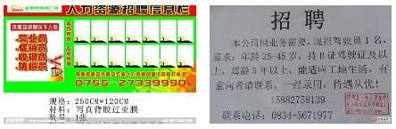
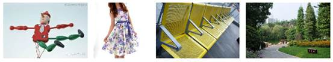
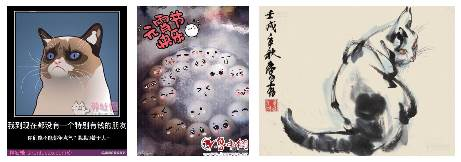
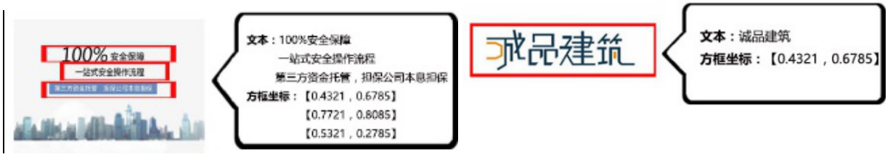

### 1.5 反垃圾广告

1)   小广告识别、广告文字提取（OCR）

广告识别服务通过以下特征识别正常、二维码、带文字广告图片、带文字正常图片，并把带文字图片中的文字提取出来，识别示例如下图：

* **正常：**图片中无二维码、无文字或有文字但不是后期加上去的；

* **二维码：**图片中包含二维码信息的；

* **带文字广告图片：**图片中带有后期加上去的文字，且属于广告；

* **带文字广告图片：**图片中带有后期加上去的文字，但不属于广告。

**图 1-10 二维码图片示例**

**图 1-11 带文字广告图片示例**

**图 1-12 正常图片示例**

**图 1-13 带文字正常图片示例**

**图 1-14 图片文字提取示例**