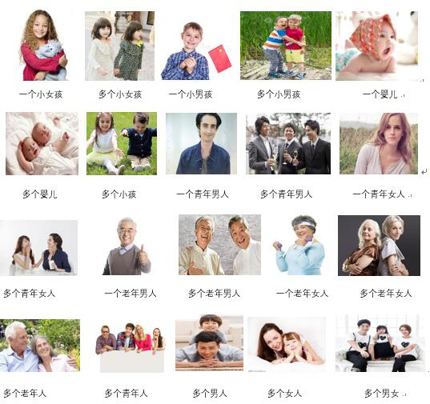
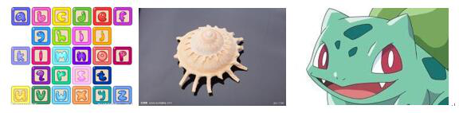
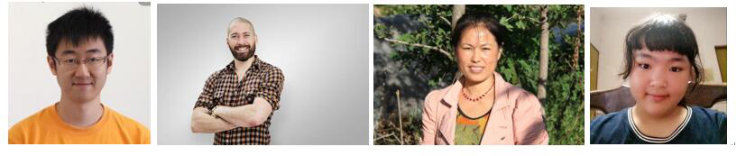
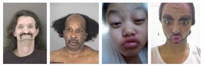
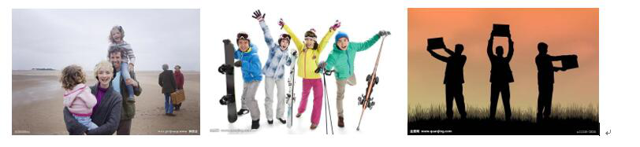
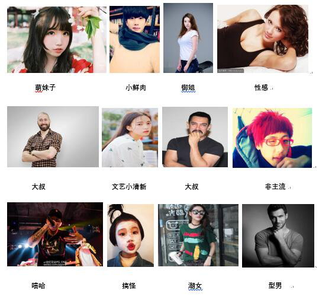
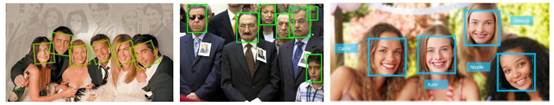

### 1.6 人脸识别

1)   人脸特征

人脸特征识别支持多维度人脸特征分析，共包括 7 个 API 接口，分别是：人物细分识别、性别识别、表情识别、年龄段识别、颜值识别、气质风格识别、头发长度识别、戴帽识别，具体说明如下：

*  **人物细分类别识别：**根据性别、年纪、人数三个维度把图片分为 21类，识别示例如下图：

**图 1-15 人物细分类别示例图**

*  **性别识别：**根据性别维度把图片分为四类，识别示例如下图：

**图 1-16 男人：露出全脸的，侧脸的有男性特征的真人或动漫人物**

**图 1-17 女人：露出全脸的，侧脸的有女性特征的真人或动漫人物**

**图 1-18 多人：有多个可辨别面部特征的人或动漫人物**

**图 1-19 其他：没有人，或有人但没有显示脸部的，或模糊无法辨认的图片**

*  **颜值识别：**根据颜值高低，把图片分为 4 类，识别示例如下图：

**图 1-20 高颜值示例图**

**图 1-21 普通颜值示例图**

**图 1-22 低颜值（难看）示例图**

**图 1-23 其他：图片中显示多人或无人**

*  **气质风格：**根据气质风格，把图片分为 16 类，识别示例如下图：

**图 1-24 气质风格示例图**

*  **表情识别：**识别内容包括喜悦、愤怒、恐惧、悲伤、厌恶、惊讶、平静、蔑视、痛苦；

*  **头发长度：**识别内容包括光头、平头、短发、中长发、长发、盘发；

*  **戴帽识别：**识别内容包括针织帽、棒球帽、遮阳帽、牛仔帽、迷彩帽、包头帽、雷锋帽、鸭舌帽、礼帽、贝雷帽、头巾、空顶帽、渔夫帽、军帽、连衣帽、头盔、其他帽子；

2)   人脸检测

在图像中定位人脸的位置坐标，识别示例如下图：

**图 1-25 人脸检测示例图**

3)   人脸比对

4)   人脸搜索