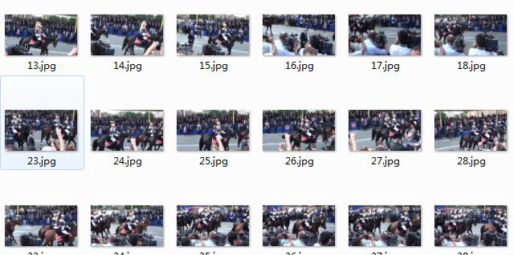

###  1.9 图像搜索

通过设定图片、视频集，利用图像搜索比对的方法，在海量数据中定位与预设样本近似或相同的图片、视频，实现精准、实时的搜索与过滤。识别示例如下图：

1)    敏感视频搜索系统

用户可以自定义视频黑名单违禁库，在用户调用时候，可以将视频与违禁视频库进行做比对，然后得出该视频是否在违禁视频库内；

*  设定数据集：

**图 1-31 图片数据集案例**

*  在海量数据中，定位与预设样本的相似或相同图片、视频：

**图 1-32 视频搜索的结果示例图**

2)    热点视频统计系统

该系统支持动态视频库，可容纳用户自定义的 50 万（标准容量）个视频。用户可通过上传调用视频，与库内的样本视频进行匹配，并统计其被重复上传的次数。