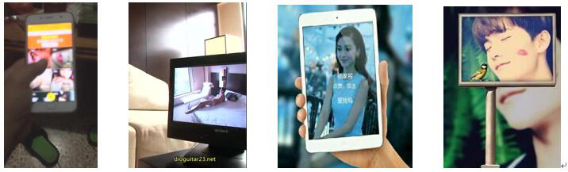
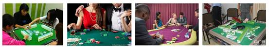

### 1.4 直播实时监控

监控对象为画中画、床上直播、车内直播、抽烟、涉嫌赌博等常见违规场景，监控对象说明如下：

*  **画中画：**主播利用直播APP转播电子设备上播放的多媒体内容，转播内容可能有涉黄、侵犯视频版权的风险；

*  **床上直播：**主播在床上进行直播，这类直播可能带有不雅内容或色情暗示等内容；

*  **车内直播：**直播场景发生在车内，有可能是司机驾驶过程中进行直播，该行为会影响出行安全，须加以管控；

*  **抽烟：**主播直播时抽烟，会对未成年观众产生不良诱导，属于国家监管部门禁止直播的内容；

*  **涉嫌赌博：**直播打牌、打麻将等行为，有涉嫌赌博的风险，属于国家监管部门要求平台须严格审核的范畴。

**图 1-5 画中画示例**

**图 1-6 床上直播示例**

**图 1-7 车内直播示例**

**图 1-8 主播抽烟示例**

**图 1-9 涉嫌赌博示例**