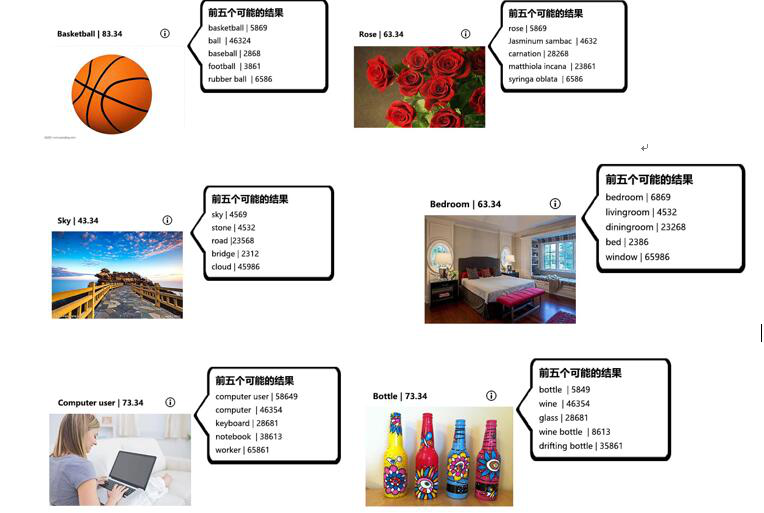
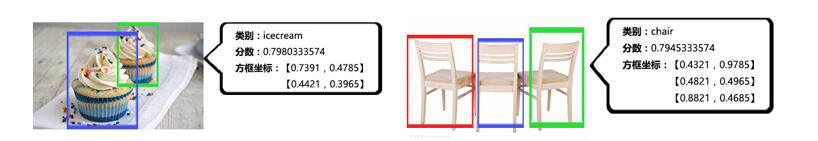
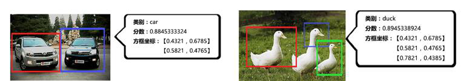
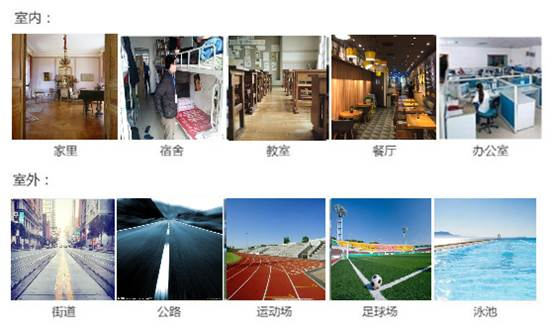

###  1.7 自然场景识别

1)   通用物体识别（两万类）

物体识别服务可识别超过两万类物体，分析图片主要内容，能帮助技术团队对图像语义进行自动化解读，识别示例如下图：

**图 1-26 通用物体识别示例图**

2)   物体检测

物体检测服务能识别指定物体，并返回物体所在图片的坐标位置，识别示例如下图：

**图 1-27 物体检测示例图**

3)   场景识别

对实际应用场景分为室内、室外、自然风景和其他四大分类，每个分类都会按照实际场景细分为多个类别，根据用户上传的图片，我们会按照该图片里对应的实际场景返回结果。识别示例如下图：

**图 1-28 场景识别示例图**