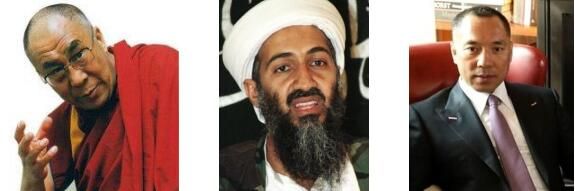

### 1.3 敏感人物识别

自动识别敏感人物，主要包括中国历任国家领导人、地方领导人，涉政人物及敏感事件中的人物进行识别。可根据人物出现视频、新闻等画面、照片进行学习标注，随时方便调用。

*  **政治人物：**国内国外历任国家领导人（习近平、特朗普等）、地方领导人等；

*  **涉政暴恐人物：**已知恐怖分子头目（本拉登、萨达姆等），政治敏感人物（达赖喇嘛、热比娅）等；

**图 1-4 涉政暴恐人物示例**
