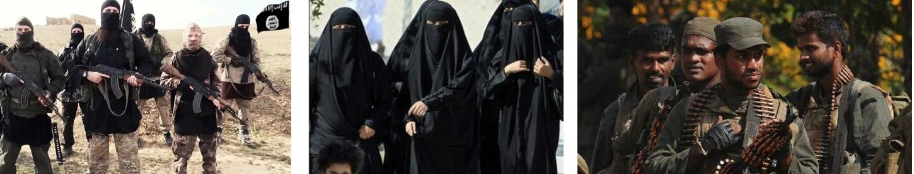
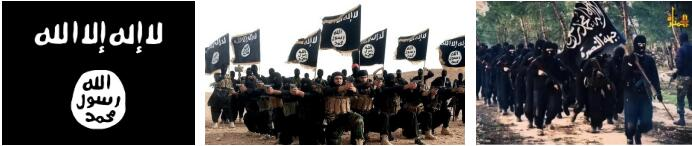
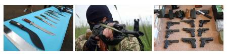

### 1.2 暴恐违规识别

暴恐识别服务根据以下特征识别可能涉及暴恐或违规内容图片或视频。

* **特殊着装人物：**穿着迷彩服、军装、吉里巴甫服饰等人物，中东男子等；

* **特殊符号：**出现在图片中（包括书籍）的维文、藏文、阿拉伯文字；暴恐犯罪组织的标志，犯罪分子电视台台标，伊斯兰教宗教符号；藏独旗帜（雪山狮子旗），疆独旗帜（星月旗），ISIS 旗帜等暴恐反动组织的旗帜；

* **武器/持武器者：**枪支、管制刀具或者其持有者；

* **国家标识：**即图片中包含有世界上某一个国家的国旗、国徽的；

* **正常：**不具备以上特征的。

**图 1-1 特殊着装人物示例**

**图 1-2 特殊符号示例**

**图1-3 武器-持武器者示例**
